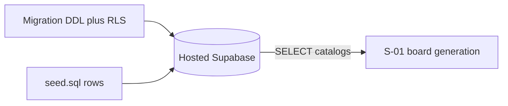

# Seed Phrase Reward Catalog — Plan Brief

> Full plan: `context/changes/seed-phrase-reward-catalog/plan.md`

## What & Why

F-01 delivers the predefined RPG phrase pool and admin reward catalog in Supabase so S-01 can draw boards. Without seedable catalogs, board generation has nothing to sample from; MVP deliberately skips an admin UI and loads data at apply/seed time.

## Starting Point

Auth-only Supabase client and empty `supabase/` data surface: no migrations, no `seed.sql` (though `config.toml` already references it), no catalog types or queries in `src/`. App already talks to a hosted Supabase project.

## Desired End State

Hosted Supabase has readable `phrases` and `rewards` (≥26 Polish phrases; rewards with slug/label/description) under SELECT-only RLS for anon and authenticated. No Docker/local DB required for F-01. No app UI or session schema yet.

## Key Decisions Made

| Decision | Choice | Why (1 sentence) |
| -------- | ------ | ---------------- |
| Catalog shape | Two tables: `phrases` + `rewards` | Matches PRD’s two pools; independent query/select for S-01 |
| Seed delivery | Migration for DDL/RLS + `seed.sql` for rows | Matches CLI config; content edits don’t churn migrations |
| RLS | SELECT for `anon` + `authenticated`; no client writes | Enough for board clients; MG cannot edit the global pool |
| Phrase columns | `id`, `text` (unique), `created_at`; no categories | Smallest schema; FR-017 can add columns later |
| Reward columns | `id`, `slug`, `label`, `description`, `created_at` | Stable slug + UI label; description ready for claim UX |
| Content authorship | Agent drafts; human reviews before merge | Unblocks S-01 without a separate content sprint |
| App surface | SQL + seed only — no `src/` | Keeps F-01 as pure data contract; TS reads in S-01 |
| Verify target | Hosted Supabase (no Docker) | Avoids local DB; never use `db reset` on hosted |

## Scope

**In scope:**
- Migration creating `phrases` and `rewards` with RLS
- `supabase/seed.sql` with Polish content
- Apply + verify on hosted Supabase (additive only)
- Runbook notes in `change.md` (including `db reset` ban)

**Out of scope:**
- Session/board schema, MG custom phrases, admin UI, categories, custom/team rewards
- TypeScript types/helpers, CI auto-migrate/seed, local Docker verify path

## Architecture / Approach

## Phases at a Glance

| Phase | What it delivers | Key risk |
| ----- | ---------------- | -------- |
| 1. Schema + RLS | Tables + SELECT-only policies on hosted | Irreversible mistake without careful SQL review |
| 2. Seed content | ≥26 phrases + reward list on hosted | Tone/fit needs human edit before seed run |
| 3. Verify + notes | Hosted proof + runbook (`db reset` banned) | Accidental `db reset` would wipe auth |

**Prerequisites:** Access to hosted Supabase SQL (Dashboard or linked CLI); human approval before applying migration.
**Estimated effort:** ~1 short session across 3 phases (content review + careful hosted apply).

## Open Risks & Assumptions

- Using prod as the verify DB means schema mistakes hit the live project — mitigate by human SQL review and additive-only apply (never `db reset`).
- CI smoke will not prove catalog rows — accepted for F-01.
- Anon SELECT makes the full phrase bank scrapeable; acceptable at MVP table scale.
- Phrase `text` uniqueness is global; duplicate wording is rejected at insert.

## Success Criteria (Summary)

- On hosted DB, catalogs exist, are SELECT-readable (including anon), and reject client writes.
- Seed meets the ≥26 phrase floor and includes a usable reward list with descriptions.
- Runbook documents hosted apply and forbids `db reset`; `src/` unchanged.
