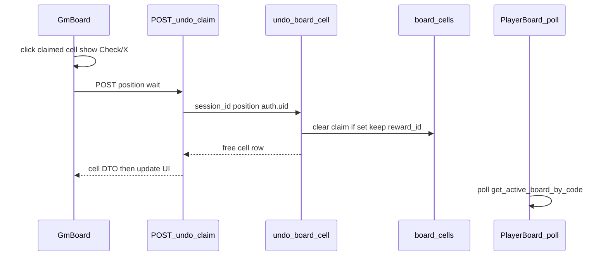

# GM Undo Field Claim Implementation Plan

## Overview

Deliver FR-012 / S-04: the GM clears a mistaken field claim from `/sessions/[id]`. Occupancy (`claimed_by_player_id` / `claimed_at`) is cleared; `reward_id` stays so a later claimer can win the same reward. Players learn via existing ~5s polls (mystery frame returns). No separate rewards ledger — voiding the grant is clearing occupancy.

## Current State Analysis

- Claims: SECURITY DEFINER `claim_board_cell` first-wins update (`supabase/migrations/20261003190000_player_claim_token.sql` ~168–174); API `src/pages/api/play/claim.ts`; service `claimBoardCell` in `src/lib/services/sessions.service.ts`.
- No undo RPC/API; `src/components/sessions/GmBoard.tsx` cells are non-interactive `
`s; GM poll GET `src/pages/api/sessions/[id]/board.ts`.
- Reward on cell is layout (`reward_id`); player labels appear only while claimed (`get_active_board_by_code`).
- S-03 archived plan deferred undo; no anon `UPDATE` on `board_cells` — writes stay SECURITY DEFINER.
- `src/pages/sessions/[id].astro` has `session.status` but does not pass it into `GmBoard` yet.

## Desired End State

GM on an **active** session clicks a claimed cell → on-tile **Check** / **X** → Check waits for API then frees the cell (phrase + reward badge back); X dismisses. Already-free undo is success. Players see free + mystery-until-claim within ~10s. Closed sessions: no undo chrome; RPC rejects.

### Key Discoveries:

- Mirror claim: SECURITY DEFINER + thin authenticated API + origin check (`src/lib/request-origin.ts`).
- Idempotent clear when `claimed_by_player_id IS NOT NULL`; if already null, return free cell as success.
- No green token today — add a `success` role token for the Check control; `destructive` for X (`src/styles/global.css`); `GmBoard` is in `lint:ui-literals` scope.
- Pass `sessionStatus` into `GmBoard` so closed boards stay read-only even if someone hits the API.

## What We're NOT Doing

- Clearing or relocating `reward_id` / permanent reward removal from the cell
- Team-line / FR-014 rollback
- Player-initiated undo; undo on `closed` sessions
- Optimistic UI; websockets; regenerate board (S-05)
- Audit log of undos; toast/modal confirm (confirm is on-tile only)

## Implementation Approach

One migration RPC `undo_board_cell(p_session_id uuid, p_position smallint)` → GRANT `authenticated`. Service + `POST /api/sessions/[id]/undo-claim`. `GmBoard` confirm chrome + wait-for-API. Kitchen-sink fixtures. Regen `database.types.ts` after local migrate.

## Critical Implementation Details

**User experience:** At most one cell in confirm mode. Check/X are real buttons with Polish `aria-label`s (e.g. “Cofnij oznaczenie”, “Anuluj”). While the request is in flight, disable both and show a busy state on that tile; only then apply the free-cell state (no optimism). Poll must not wipe confirm chrome mid-gesture — ignore poll overwrites for the cell in confirm/pending, or pause merging that cell until settle.

**Active gate:** UI hides/disables undo when `sessionStatus !== "active"`. RPC also requires `sessions.status = 'active'` and `gm_id = auth.uid()`.

## Phase 1: DB undo RPC

### Overview

Add SECURITY DEFINER `undo_board_cell` that clears claim columns for the GM’s active session; idempotent if already free; never touches `reward_id`.

### Changes Required:

#### 1. Migration

**File**: `supabase/migrations/YYYYMMDDHHmmss_undo_board_cell.sql`

**Intent**: Atomic GM undo write path matching claim’s SECURITY DEFINER pattern so RLS never needs anon/GM UPDATE on `board_cells`.

**Contract**:
- Args: `p_session_id uuid`, `p_position smallint`
- Auth: `sessions.id = p_session_id AND gm_id = auth.uid() AND status = 'active'`; else raise `session_not_found` (same opacity as claim)
- Validate position against `size`; missing cell → `cell_not_found`
- `UPDATE … SET claimed_by_player_id = NULL, claimed_at = NULL WHERE session_id AND position AND claimed_by_player_id IS NOT NULL`
- Always return one row describing the **free** cell (phrase, has_reward from `reward_id`, reward slug/label for GM mapping, null claim color) whether the UPDATE matched or the cell was already free
- `REVOKE ALL … FROM PUBLIC`; `GRANT EXECUTE … TO authenticated` only
- Respect `board_cells_claim_pair_chk` (both claim columns null together)

#### 2. Generated types

**File**: `src/db/database.types.ts` (via `supabase gen types` after local migrate)

**Intent**: Keep RPC typings in sync with the new function.

**Contract**: `Functions.undo_board_cell` present with the migration’s args/returns.

### Success Criteria:

#### Automated Verification:

- Migration applies on local Supabase (`npx supabase db reset` or migration up — local only; never hosted reset)
- `database.types.ts` includes `undo_board_cell`
- Lint/typecheck clean for touched generated types path as used in CI (`npm run lint`, `astro check` when run)

#### Manual Verification:

- (Deferred to Phase 3 — SQL/RPC checks run with the end-to-end GM undo path.)

**Implementation Note**: No Phase 1 manual gate. After automated verification passes, proceed to the phase-end commit ritual. Phase blocks use plain bullets — Progress checkboxes live in `## Progress`.

---

## Phase 2: Service + GM API

### Overview

Expose undo to the authenticated GM client with zod validation, origin check, and Polish errors consistent with claim/board APIs.

### Changes Required:

#### 1. Schema

**File**: `src/lib/schemas/session-undo-claim.ts` (new)

**Intent**: Validate undo body (`position` integer in board range is enforced server-side via RPC; zod at least non-negative int).

**Contract**: Export zod schema used by the route (mirror `src/lib/schemas/play-claim.ts` style).

#### 2. Service

**File**: `src/lib/services/sessions.service.ts`

**Intent**: Call `undo_board_cell` and map to a GM cell DTO compatible with `SessionWithCells["cells"][number]` (including `claimedByColor: null`, reward join fields).

**Contract**: `undoBoardCell(supabase, { sessionId, position })` — RPC auth via `auth.uid()` from the SSR client session; map `session_not_found` / `invalid_position` / `cell_not_found` to a typed error class (mirror `ClaimBoardCellError`). Return `{ cell }` on success (idempotent free included).

#### 3. API route

**File**: `src/pages/api/sessions/[id]/undo-claim.ts` (new)

**Intent**: GM-only POST entrypoint for undo.

**Contract**:
- `export const prerender = false`
- `POST` only; `locals.user` required (401); session id UUID pattern (404); `isAllowedRequestOrigin` (403)
- Body: `{ position }`; success `200` + `{ cell }`; map service errors to 404/400/500 with Polish messages
- Do not require player cookie

#### 4. Types

**File**: `src/types.ts`

**Intent**: Shared success/error DTOs for the undo response.

**Contract**: e.g. `UndoClaimSuccessResponse { cell: SessionWithCells["cells"][number] }`

### Success Criteria:

#### Automated Verification:

- `npm run lint` passes
- `npx astro check` passes (or project’s CI type gate)

#### Manual Verification:

- (Deferred to Phase 3 — auth/origin/error cases verified with the GM undo UX path.)

**Implementation Note**: No Phase 2 manual gate. After automated verification passes, proceed to the phase-end commit ritual.

---

## Phase 3: GmBoard undo UX

### Overview

Claimed cells become the undo control surface with on-tile Check/X confirm and wait-for-API updates; active-only.

### Changes Required:

#### 1. Success token (for green Check)

**File**: `src/styles/global.css`

**Intent**: Provide a role token for the confirm control so views stay literal-free.

**Contract**: `--success` / `--success-foreground` on `:root`/`.dark` and `@theme inline` (`bg-success`, `text-success-foreground`). Vintage-paper-compatible green; not a Tailwind palette class in components.

#### 2. Pass session status

**File**: `src/pages/sessions/[id].astro`

**Intent**: Let the island gate undo when the session is not active.

**Contract**: Pass `sessionStatus={session.status}` (or boolean `undoEnabled={session.status === "active"}`) into `GmBoard`.

#### 3. GmBoard interactivity

**File**: `src/components/sessions/GmBoard.tsx`

**Intent**: Implement click → on-tile confirm → POST → update cell; cancel with X.

**Contract**:
- Free cells remain non-interactive
- Claimed + undo enabled: click enters confirm mode (Check + X overlay/buttons on that tile only)
- Check: set pending, `POST /api/sessions/${id}/undo-claim` with `{ position }`, on success replace cell from response; on failure show short inline/banner error and leave claim; clear pending
- X: exit confirm mode, no request
- Use `Button` + lucide `Check` / `X` with `bg-success` / `bg-destructive` (or equivalent role classes)
- Poll merge must not clobber confirm/pending cell state
- `preview` kitchen-sink mode: no network (or no-op POST) for fixtures

### Success Criteria:

#### Automated Verification:

- `npm run lint` (includes ui-literals on `GmBoard`)
- `npx astro check` passes

#### Manual Verification:

- Active session: claimed click → Check/X → Check frees after wait; X keeps claim; player board shows free + mystery within ~10s; reward label still on GM free cell
- Closed session: no confirm chrome
- Double Check / already free: success, no error banner
- SQL/RPC (from Phase 1): as GM JWT, undo a claimed cell clears claim columns and leaves `reward_id`; second undo on same cell succeeds; non-owner / closed session fails
- API (from Phase 2): authenticated GM POST undoes a claimed cell; unauthenticated 401; wrong GM / bad id 404; cross-origin blocked

**Implementation Note**: After completing this phase and all automated verification passes, pause here for manual confirmation from the human that the manual testing was successful before proceeding to the next phase.

---

## Phase 4: Kitchen-sink + verification

### Overview

Visual gates for undo chrome states; run repo gates; manual table path.

### Changes Required:

#### 1. GM board kitchen-sink

**File**: `src/pages/sessions/board/kitchen-sink.astro`

**Intent**: Fixture states for confirm chrome, pending/busy, and error so regressions are visible in DEV.

**Contract**: New sections using `GmBoard` `preview` (and props as needed) for: claimed ready, confirm open, pending, error after failed undo. Keep PROD 404. Extend `SCOPED_FILES` only if new tokenized view files are added (kitchen-sink already scoped).

### Success Criteria:

#### Automated Verification:

- `npm run lint`
- `npm run build` (or CI-equivalent) when verifying the slice
- `npm run smoke` against running preview still passes (auth flow unchanged)

#### Manual Verification:

- Kitchen-sink sections render confirm/pending/error
- Full path: player claims → GM undoes → player sees free mystery → player (or other) can claim again and get the same reward if `reward_id` present

**Implementation Note**: After completing this phase and all automated verification passes, pause here for manual confirmation from the human that the manual testing was successful.

---

## Testing Strategy

### Unit Tests:

- None (no unit runner in-repo).

### Integration Tests:

- Existing `npm run smoke` remains auth-flow; no new smoke script required (decision 7).

### Manual Testing Steps:

1. Create session, join two players, claim a rewarded cell as player A.
2. As GM, open confirm on that cell, press X — still claimed.
3. Open confirm, press Check — after wait, cell free with phrase + reward badge; player polls show free + frame without label.
4. Player B claims same cell — gets same reward reveal.
5. With session `closed` (fixture or DB), confirm chrome absent; API rejects.

## Performance Considerations

No new poll interval; undo is a single POST. Confirm/pending gating avoids poll thrash on the active tile.

## Migration Notes

- Local: apply migration + regen types before Phase 2.
- Hosted Supabase: human-approved `db push` (never `db reset` on hosted — lessons.md).
- Rollback: reverse migration drops function; code deploy without RPC fails undo only — keep expand/migrate ordering.

## References

- PRD FR-012: `context/foundation/prd.md`
- Roadmap S-04: `context/foundation/roadmap.md`
- Prior claim slice: `context/archive/2026-10-03-player-claim-field-reward/`
- Claim RPC: `supabase/migrations/20261003190000_player_claim_token.sql`
- GM board: `src/components/sessions/GmBoard.tsx`

## Progress

> Convention: `- [ ]` pending, `- [x]` done. Append ` — <commit sha>` when a step lands. Do not rename step titles. See `references/progress-format.md`.

### Phase 1: DB undo RPC

#### Automated

- [x] 1.1 Migration applies on local Supabase — 37176f7
- [x] 1.2 database.types.ts includes undo_board_cell — 37176f7
- [x] 1.3 Lint/typecheck clean for generated types path — 37176f7

### Phase 2: Service + GM API

#### Automated

- [x] 2.1 npm run lint passes — 4e4c425
- [x] 2.2 astro check passes — 4e4c425

### Phase 3: GmBoard undo UX

#### Automated

- [x] 3.1 npm run lint passes (ui-literals on GmBoard) — ed29031
- [x] 3.2 astro check passes — ed29031

#### Manual

- [x] 3.3 Active: Check/X wait-for-API free; player mystery restored; GM reward badge remains — ed29031
- [x] 3.4 Closed: no confirm chrome — ed29031
- [x] 3.5 Already-free / double Check: quiet success — ed29031
- [x] 3.6 SQL: GM undo clears claim keeps reward_id; idempotent; non-owner/closed fail — ed29031
- [x] 3.7 API: Authenticated GM POST undoes; 401/404/403 cases verified — ed29031

### Phase 4: Kitchen-sink + verification

#### Automated

- [x] 4.1 npm run lint passes
- [x] 4.2 npm run build passes
- [x] 4.3 npm run smoke passes

#### Manual

- [x] 4.4 Kitchen-sink confirm/pending/error sections
- [x] 4.5 Full claim → undo → reclaim same reward path
