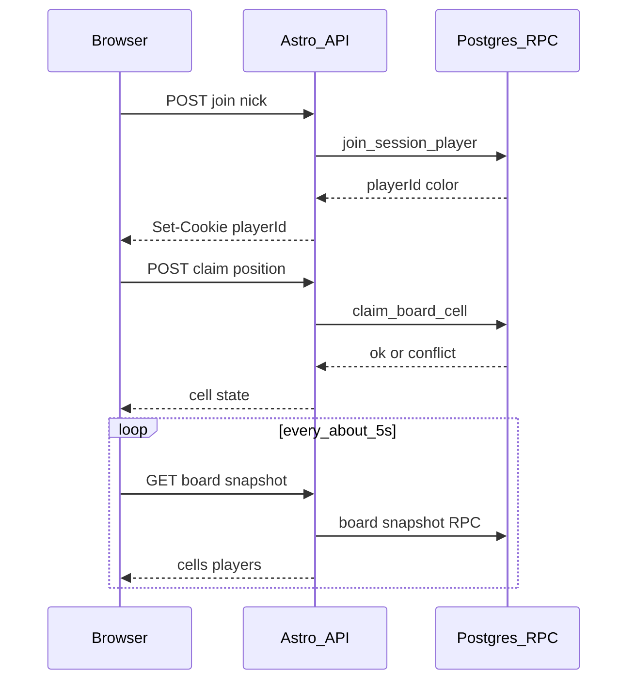

# Player claim field reward Implementation Plan

## Overview

Deliver roadmap S-03 (north star): a joined anonymous player claims a free board cell, the database enforces first-wins under near-simultaneous clicks, the claimer immediately sees the reward type via a flip/reveal (presence was only a colored frame before claim), other participants see occupancy within ~10s via polling, and the Game Master maps claimer color on cells to a join roster (nick in color) while still seeing reward labels on every cell.

## Current State Analysis

- Sessions and `board_cells` exist with phrase + optional `reward_id`; there are no claim columns, no `session_players` table, and no unique/first-wins guard for occupancy (`supabase/migrations/20260927143000_sessions_and_board_cells.sql`).
- Anonymous board read is `get_active_board_by_code` (SECURITY DEFINER) returning full reward labels; no anon table grants (`supabase/migrations/20261003120000_player_board_by_code.sql`).
- Player identity is an httpOnly `rpg_player` cookie with per-code `{ nick, color, seen }` and random color 1–16 (`src/lib/player-cookie.ts`); `POST /api/play/join` only writes that cookie (`src/pages/api/play/join.ts`).
- Player board at `/play/[code]` renders static Astro `BoardGrid` (phrase + reward badge + spoiler legend); no click handlers (`src/pages/play/[code].astro`, `src/components/sessions/BoardGrid.astro`).
- GM board at `/sessions/[id]` uses the same static grid with full labels; no roster (`src/pages/sessions/[id].astro`).
- Player color tokens `--player-1`…`--player-16` already exist in `src/styles/global.css`.
- S-01 foreshadowed `claimed_by`/`claimed_at` on cells; S-02 deferred claims, occupants, polling, and CSRF until claims bind to the cookie.
- PRD FR-010 currently states reward type is visible from the start; this change amends it so players see presence only until claim.

## Desired End State

- Join creates a `session_players` row (nick, sequential color by join order, cycling 1–16), cookie stores `playerId` + nick + color for that code.
- Claiming a free cell succeeds for the first writer; losers get a typed conflict and an updated grid showing the occupant’s color.
- On the player board, unclaimed rewarded cells show only a colored frame (`hasReward`); after claim the cell flips (animation best-effort), shows the reward label (single line, ellipsis), and fills with the claimer’s color. No toast/modal. Spoiler type-legend is gone.
- Player and GM boards poll (~5s) so occupancy appears within the 10s NFR without manual refresh.
- GM board keeps reward labels on all cells, paints claimed cells with claimer color, and lists joined players (nick in color) under the board.
- FR-010 in `context/foundation/prd.md` matches the mystery-until-claim player rule; CSRF origin/referrer checks protect join and claim POSTs.

### Key Discoveries:

- SECURITY DEFINER + no anon table policy is the established player data path (`20261003120000_player_board_by_code.sql:3-28`) — extend it for join, claim, and poll snapshots rather than opening table RLS to anon.
- `BoardGrid.astro` is display-only divs (`BoardGrid.astro:20-28`); player interactivity requires a React island (or equivalent), while GM can stay closer to Astro plus a small poll island.
- Cookie today has no server player id (`player-cookie.ts:9-13`); claims must bind to a DB row id, so the cookie contract grows a `playerId`.
- Smoke already covers join → board render (`scripts/smoke.mjs`); extend with claim + conflict steps.

## What We're NOT Doing

- GM undo / void revoke (S-04)
- Board regenerate / new code (S-05)
- WebSockets or true realtime (FR-013 remains nice-to-have; polling satisfies the 10s NFR)
- Team/line rewards (FR-014), custom MG rewards (FR-015)
- Unique nicknames per session
- Anon `SELECT`/`UPDATE` policies on `sessions`, `board_cells`, or `session_players`
- Blocking toast/modal reward UX
- Nick text painted on claimed cells (color + roster is enough for GM)
- Adding a unit-test runner — verification remains lint/check/build + smoke + manual

## Implementation Approach

Persist players at join time, claim cells with a single atomic “set claimer where still free” update inside a SECURITY DEFINER RPC, expose player-safe snapshots that leak `hasReward` but not unclaimed labels, and drive both boards with a short poll interval. Player UI becomes an interactive island implementing mystery frame → flip reveal; GM UI adds colored occupancy, roster, and poll while keeping labels. Amend FR-010 in the same change so product docs match the shipped mystery rule.

## Critical Implementation Details

- **First-wins**: claim must be one conditional update (`claimed_by_player_id IS NULL`); application-level read-then-write is not enough for the PRD guardrail.
- **Player snapshot secrecy**: unclaimed cells may expose `hasReward: boolean` only; `reward.label`/`slug` appear for a cell only after it is claimed (public reveal) or on the authenticated GM path (always).
- **Cookie binding**: re-confirming nick in the same browser with a valid `playerId` for that session keeps the row (update nick if needed); a browser without that id creates a new `session_players` row even if the nick string matches another player.
- **Color assignment**: `color = ((join_ordinal - 1) % 16) + 1` where ordinal is insert order per session (not `randomPlayerColor`).
- **Cut line**: if time is tight, ship reveal as an immediate state swap and drop flip animation polish.

## Phase 1: PRD + schema + types

### Overview

Align the product contract (FR-010) with mystery-until-claim, and add the database tables/columns/RLS needed for players and first-wins claims.

### Changes Required:

#### 1. PRD FR-010 amendment

**File**: `context/foundation/prd.md`

**Intent**: Record that players see which cells offer a reward, but learn which reward only after the cell is claimed; keep GM ability to see types from the start as the operational path.

**Contract**: Update FR-010 text and its Socrates note; update Business Logic paragraph (~L121) and any US-01 wording that asserts pre-claim type visibility for players so they no longer contradict the new rule.

#### 2. Migration — session players and claims

**File**: `supabase/migrations/YYYYMMDDHHmmss_session_players_and_claims.sql` (timestamp at implement time)

**Intent**: Persist joiners and attach at most one claimer per cell so concurrent claims cannot double-book.

**Contract**:
- Table `session_players`: `id uuid PK`, `session_id` FK → `sessions`, `nick text`, `color smallint` check 1–16, `created_at`; RLS on; GM-owner SELECT policy; no anon table grants.
- `board_cells.claimed_by_player_id` nullable FK → `session_players`, `claimed_at timestamptz` nullable; claim allowed only when both null or both set (implementer chooses check constraint if useful).
- No anon UPDATE/INSERT on `board_cells`; writes go through SECURITY DEFINER functions added in later phases (stubs may live here if preferred for one migration).

#### 3. Generated and app types

**File**: `src/db/database.types.ts`, `src/types.ts`

**Intent**: Expose player and claim fields to the TypeScript layer used by services and UI.

**Contract**: Regenerate DB types locally (`supabase gen types`); extend `PlayerBoard` / session DTOs with occupancy, `hasReward`, optional revealed reward, claimer color, and a players roster type for GM.

### Success Criteria:

#### Automated Verification:

- Migration applies on local Supabase without error
- `npm run lint` passes after type updates
- `npx astro check` passes

#### Manual Verification:

- FR-010 and Business Logic in `prd.md` read as mystery-until-claim for players; GM type visibility is not forbidden by the PRD text

**Implementation Note**: After completing this phase and all automated verification passes, pause here for manual confirmation from the human that the manual testing was successful before proceeding to the next phase. Phase blocks use plain bullets — the corresponding `- [ ]` checkboxes for these items live in the `## Progress` section at the bottom of the plan.

---

## Phase 2: Join creates session_players

### Overview

Turn nick confirm into a persisted player row with sequential color and a cookie that carries `playerId`.

### Changes Required:

#### 1. Join RPC

**File**: `supabase/migrations/…` (same or follow-up migration as Phase 1)

**Intent**: Allow the anonymous server client to insert a player without granting table INSERT to anon.

**Contract**: SECURITY DEFINER function (e.g. `join_session_player(p_code text, p_nick text)`) validates active session + nick rules, assigns next join-order color in 1–16 (cycle), inserts `session_players`, returns `id` + `color` + `nick`. GRANT EXECUTE to `anon`, `authenticated`.

#### 2. Cookie contract

**File**: `src/lib/player-cookie.ts`

**Intent**: Bind the browser to the DB player row for later claims.

**Contract**: `PlayerIdentity` includes `playerId` (uuid string). Writers/readers accept and persist it. Color in the cookie mirrors the DB-assigned color (stop using `randomPlayerColor` for new joins). Invalid/missing `playerId` means “no bound player” for claim.

#### 3. Join API + CSRF

**File**: `src/pages/api/play/join.ts`, new helper e.g. `src/lib/request-origin.ts` (name as fits repo)

**Intent**: Create or rebind the player on confirm and reject cross-site POSTs.

**Contract**: After active-board check, call join RPC (new row when no valid `playerId` for code; keep/update existing row when cookie `playerId` still belongs to that session). Set cookie. Origin/referrer allowlist check on POST (same helper reused in Phase 3). Preserve existing form-urlencoded + redirect behavior expected by smoke.

### Success Criteria:

#### Automated Verification:

- `npm run lint` passes
- `npx astro check` passes
- Existing smoke join steps still pass against local preview

#### Manual Verification:

- Two browsers can join the same code with the same nick and receive different colors in join order
- Re-confirm in the same browser keeps the same color/`playerId`
- Cross-site fashioned join POST is rejected (or no-ops safely per chosen CSRF failure mode)

**Implementation Note**: After completing this phase and all automated verification passes, pause here for manual confirmation from the human that the manual testing was successful before proceeding to the next phase.

---

## Phase 3: Claim API + board read contracts

### Overview

Add first-wins claim and board snapshots safe for players (no unclaimed labels) plus poll endpoints for player and GM.

### Changes Required:

#### 1. Claim RPC

**File**: migration SQL

**Intent**: Atomically assign a free cell to the calling player and return success or conflict occupant.

**Contract**: SECURITY DEFINER `claim_board_cell(p_code, p_player_id, p_position)` (or equivalent) verifies active session, player belongs to session, cell exists; `UPDATE … SET claimed_by_player_id, claimed_at WHERE claimed_by_player_id IS NULL`; on zero rows return conflict with current claimer nick/color; on success return cell including reward label for reveal. GRANT to `anon`, `authenticated`.

#### 2. Board snapshot RPC / service updates

**File**: migration SQL, `src/lib/services/sessions.service.ts`

**Intent**: Serve occupancy and reward presence for polling without spoiling unclaimed reward types to players.

**Contract**: Extend or replace `get_active_board_by_code` so player reads include per cell: position, phrase, `hasReward`, claimer color (if any), reward label/slug only when claimed; plus players list optional or via sibling RPC. GM path (`getSessionWithCells` or dedicated query) always includes reward labels, claimer color, and ordered `session_players` for the roster.

#### 3. Claim + poll API routes

**File**: `src/pages/api/play/claim.ts`, poll routes under `src/pages/api/play/` and/or `src/pages/api/sessions/`

**Intent**: JSON claim for the island and lightweight GET snapshots for ~5s polling.

**Contract**: `POST /api/play/claim` — zod body `{ code, position }`, cookie `playerId`, CSRF check, returns 200 claimed payload or 409 conflict with occupant. Poll GET for player by code (cookie optional for read) and for GM by session id (auth + ownership). `prerender = false`.

### Success Criteria:

#### Automated Verification:

- `npm run lint` passes
- `npx astro check` passes
- Smoke can call claim after join (steps may land fully in Phase 6; route exists and typechecks here)

#### Manual Verification:

- Two near-simultaneous claims on one cell: exactly one winner in DB; loser sees conflict payload with winner color/nick
- Player JSON snapshot never includes reward label on an unclaimed cell that has a reward
- GM snapshot includes labels on unclaimed rewarded cells and claimer colors on claimed cells

**Implementation Note**: After completing this phase and all automated verification passes, pause here for manual confirmation from the human that the manual testing was successful before proceeding to the next phase.

---

## Phase 4: Player board UX

### Overview

Make the player board interactive: claim, mystery frame, flip/reveal, conflict feedback, and polling.

### Changes Required:

#### 1. Player board island

**File**: new React component under `src/components/play/` (e.g. `PlayerBoard.tsx`), wire from `src/pages/play/[code].astro`

**Intent**: Let the joined player tap a free cell, see reveal + own color, learn about conflicts, and see others’ claims within ~10s.

**Contract**:
- Unclaimed + `hasReward`: colored frame only (no label).
- Unclaimed, no reward: phrase cell, claimable.
- On successful claim: flip animation best-effort (cuttable); show reward label single-line with ellipsis; fill/border uses claimer/`player-N` tokens.
- Claimed by anyone: player color; label visible if reward exists (public after claim).
- Conflict: clear “already taken” message and merge server cell state (no silent dead click).
- Poll ~5s; no toast/modal.
- Remove type-spoiling reward legend (optional: count of cells with rewards only).

#### 2. Shared grid primitives as needed

**File**: `src/components/sessions/BoardGrid.astro` and/or shared cell helpers

**Intent**: Avoid duplicating broken markup between GM Astro grid and player island where a small shared presentational piece helps; do not force GM onto the player island.

**Contract**: Player path must not keep showing unclaimed reward labels. Tokenized classes only (`npm run lint:ui-literals` scope if the view is listed).

#### 3. Player kitchen sink

**File**: `src/pages/play/kitchen-sink.astro`

**Intent**: Visual gate for mystery, claimed+reward, claimed empty, and conflict states.

**Contract**: Dev-only PROD 404 preserved; add sections covering the new states.

### Success Criteria:

#### Automated Verification:

- `npm run lint` passes (including UI literals if scoped)
- `npx astro check` passes

#### Manual Verification:

- On a phone-sized viewport, tap claims a free cell; reward presence frame flips to label; cell takes player color
- Second player loses a race and sees occupied state + message; within ~10s the other phone shows the claim without manual refresh
- Flip animation may be absent if cut; reveal still happens

**Implementation Note**: After completing this phase and all automated verification passes, pause here for manual confirmation from the human that the manual testing was successful before proceeding to the next phase.

---

## Phase 5: GM board UX

### Overview

Show claimer colors on cells, keep reward labels, list joined players under the board, and poll.

### Changes Required:

#### 1. GM session page

**File**: `src/pages/sessions/[id].astro` (+ small React island if poll/interactivity needs it)

**Intent**: Let MG see who joined and which colored cells they own while still reading every reward label.

**Contract**: Claimed cells use `player-N` color styling; unclaimed rewarded cells still show labels; under the grid, roster of `session_players` ordered by join time with nick in that color; poll ~5s for cells + roster. No nick text required on cells.

#### 2. GM kitchen sink

**File**: `src/pages/sessions/board/kitchen-sink.astro`

**Intent**: Cover claimed-color + roster states for visual review.

**Contract**: Dev-only; add representative claimed/roster fixtures without breaking existing sections.

### Success Criteria:

#### Automated Verification:

- `npm run lint` passes
- `npx astro check` passes

#### Manual Verification:

- MG sees reward labels on free cells; after a player claims, the cell becomes that player’s color within ~10s
- Roster under the board lists joiners with matching colors so MG can map color → nick → reward on that cell

**Implementation Note**: After completing this phase and all automated verification passes, pause here for manual confirmation from the human that the manual testing was successful before proceeding to the next phase.

---

## Phase 6: Smoke + verification

### Overview

Extend dependency-free smoke for claim + conflict and run the repo verification gates.

### Changes Required:

#### 1. Smoke claim path

**File**: `scripts/smoke.mjs`

**Intent**: Prove join → claim → second claimer conflict without a browser.

**Contract**: After existing play join/board steps: claim a free position as player A (200 + claimed state); as player B attempt same position (409 + occupant); assert DB-visible board/poll reflects occupant. Stay signed-out for play steps as today’s suite does.

#### 2. Full gate

**File**: none (commands only)

**Intent**: Confirm the slice is green for CI-equivalent checks.

**Contract**: `npm run lint`, `npx astro check`, `npm run build`, `npm run smoke` against preview + local Supabase as in project norms.

### Success Criteria:

#### Automated Verification:

- `npm run lint` passes
- `npx astro check` passes
- `npm run build` passes
- `npm run smoke` passes including new claim/conflict steps

#### Manual Verification:

- One end-to-end table rehearsal: GM creates board, two phones join, one claims a rewarded cell and sees reveal, the other sees color within ~10s, GM maps color via roster to the reward label on that cell

**Implementation Note**: After completing this phase and all automated verification passes, pause here for manual confirmation from the human that the manual testing was successful before proceeding to archive/next roadmap work.

---

## Testing Strategy

### Unit Tests:

- None new — repo has no unit runner; keep it that way.

### Integration Tests:

- `scripts/smoke.mjs`: join, claim success, claim conflict, CSRF rejection if practically assertable without brittle header forging.

### Manual Testing Steps:

1. GM creates a 5×5 board with at least one rewarded cell; open GM board.
2. Player A and Player B join (optionally same nick); confirm different colors and roster entries.
3. Player A claims a rewarded cell → frame flips to label + A’s color; no toast.
4. Player B claims the same cell → conflict message; cell shows A’s color.
5. Wait ≤10s on B and on GM without refresh → occupancy matches.
6. Confirm player never saw the reward label on that cell before A’s successful claim; GM saw the label all along.

## Performance Considerations

- Poll interval ~5s on open player/GM boards only; snapshot payloads are one board (≤25 cells) plus a small roster — keep responses lean (no catalog dumps).
- Claim path is a single indexed update by `(session_id, position)`; avoid read-modify-write loops.

## Migration Notes

- Additive migration only; existing sessions get zero `session_players` and null claim columns until someone joins/claims.
- Hosted apply via human-approved `npx supabase db push` (never `db reset` on hosted — lessons.md).
- Cookie shape change: old cookies without `playerId` force re-join (nick form) before claim; acceptable for pre-north-star traffic.

## References

- Roadmap S-03: `context/foundation/roadmap.md`
- PRD US-01, FR-009, FR-010, FR-011: `context/foundation/prd.md`
- Prior foreshadowing: `context/archive/2026-09-27-gm-create-session-board/plan.md` (claims deferred)
- S-02 patterns: `context/archive/2026-10-03-player-join-shared-board/plan-brief.md`
- Board RPC: `supabase/migrations/20261003120000_player_board_by_code.sql`
- Cookie: `src/lib/player-cookie.ts`
- Player page: `src/pages/play/[code].astro`
- GM page: `src/pages/sessions/[id].astro`

## Progress

> Convention: `- [ ]` pending, `- [x]` done. Append ` — <commit sha>` when a step lands. Do not rename step titles. See `references/progress-format.md`.

### Phase 1: PRD + schema + types

#### Automated

- [x] 1.1 Migration applies on local Supabase without error
- [x] 1.2 `npm run lint` passes after type updates
- [x] 1.3 `npx astro check` passes

#### Manual

- [x] 1.4 FR-010 and Business Logic in `prd.md` read as mystery-until-claim for players; GM type visibility is not forbidden by the PRD text

### Phase 2: Join creates session_players

#### Automated

- [ ] 2.1 `npm run lint` passes
- [ ] 2.2 `npx astro check` passes
- [ ] 2.3 Existing smoke join steps still pass against local preview

#### Manual

- [ ] 2.4 Two browsers can join the same code with the same nick and receive different colors in join order
- [ ] 2.5 Re-confirm in the same browser keeps the same color/`playerId`
- [ ] 2.6 Cross-site fashioned join POST is rejected (or no-ops safely per chosen CSRF failure mode)

### Phase 3: Claim API + board read contracts

#### Automated

- [ ] 3.1 `npm run lint` passes
- [ ] 3.2 `npx astro check` passes
- [ ] 3.3 Smoke can call claim after join (steps may land fully in Phase 6; route exists and typechecks here)

#### Manual

- [ ] 3.4 Two near-simultaneous claims on one cell: exactly one winner in DB; loser sees conflict payload with winner color/nick
- [ ] 3.5 Player JSON snapshot never includes reward label on an unclaimed cell that has a reward
- [ ] 3.6 GM snapshot includes labels on unclaimed rewarded cells and claimer colors on claimed cells

### Phase 4: Player board UX

#### Automated

- [ ] 4.1 `npm run lint` passes (including UI literals if scoped)
- [ ] 4.2 `npx astro check` passes

#### Manual

- [ ] 4.3 On a phone-sized viewport, tap claims a free cell; reward presence frame flips to label; cell takes player color
- [ ] 4.4 Second player loses a race and sees occupied state + message; within ~10s the other phone shows the claim without manual refresh
- [ ] 4.5 Flip animation may be absent if cut; reveal still happens

### Phase 5: GM board UX

#### Automated

- [ ] 5.1 `npm run lint` passes
- [ ] 5.2 `npx astro check` passes

#### Manual

- [ ] 5.3 MG sees reward labels on free cells; after a player claims, the cell becomes that player’s color within ~10s
- [ ] 5.4 Roster under the board lists joiners with matching colors so MG can map color → nick → reward on that cell

### Phase 6: Smoke + verification

#### Automated

- [ ] 6.1 `npm run lint` passes
- [ ] 6.2 `npx astro check` passes
- [ ] 6.3 `npm run build` passes
- [ ] 6.4 `npm run smoke` passes including new claim/conflict steps

#### Manual

- [ ] 6.5 One end-to-end table rehearsal: GM creates board, two phones join, one claims a rewarded cell and sees reveal, the other sees color within ~10s, GM maps color via roster to the reward label on that cell
