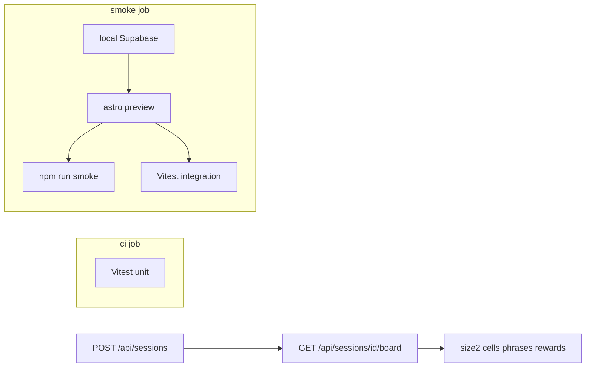

# Runner bootstrap + board integrity — Implementation Plan

> Change: `testing-runner-bootstrap-board-integrity`
> Research: `context/changes/testing-runner-bootstrap-board-integrity/research.md`
> Test plan Phase 1: `context/foundation/test-plan.md` §3 row 1

## Overview

Install Vitest as the first unit/integration runner, then lock Risk #1 (create never ships an incomplete/invalid board on the success path), Risk #9 (guaranteed custom phrases appear on the persisted board), and Risk #2 (core JSON APIs use non-2xx for failures) via HTTP tests against `astro preview` + local Supabase—the same harness CI already uses for smoke.

## Current State Analysis

- No Vitest/Jest/Playwright; only `scripts/smoke.mjs` and CI jobs `ci` + `smoke` in `.github/workflows/ci.yml`.
- Create path: `POST /api/sessions` → `createSession` → `generateBoard` → two-step insert (`sessions` then `board_cells`). Success returns **201** `{ id, code }`; client advances only on `status === 201` (`useCreateSession.ts`).
- Unknown reward → **400**; zod rejects empty custom phrase text (`session.ts`).
- Known gap (out of fix scope): cell-insert failure after session insert leaves a 0-cell orphan; API **500**, SSR incomplete → **422**. Document only.
- Board proof path: authenticated GM `GET /api/sessions/[id]/board`.

## Desired End State

- `npm test` (Vitest) runs unit tests without Supabase; integration/contract tests run against preview + local Supabase.
- CI `smoke` job runs the suite after preview is up (smoke script remains).
- Create **201** is proven by board invariants via GM board GET; guaranteed customs from the create body appear among cell phrases; failure statuses on create + thin JSON matrix are locked.
- test-plan cookbook §6.1, §6.2, §6.4, §6.5 (Phase 1 notes) filled; orphan gap called out as known / deferred.

### Key Discoveries:

- Integration must hit **preview HTTP**, not in-process Astro handlers (Cloudflare adapter / cookies / `astro:env`).
- No in-app service-role client; GM board GET is the chosen side-effect read.
- Smoke already creates admin user + cookies pattern—reuse for Vitest harness helpers.
- Roadmap has no Change ID for this folder; skip roadmap status sync.

## What We're NOT Doing

- Product fix for orphan 0-cell / transactional create
- Red/stubbed orphan test
- Blank catalog phrase enforcement or seed audits
- RLS/PostgREST bypass of create API (Risk #6 / Phase 3)
- Claim race **409** concurrency proofs, undo side effects, rejoin (Phase 2)
- `POST /api/play/join` redirect matrix
- Full response body snapshots; Playwright/e2e
- Replacing or removing `npm run smoke`

## Implementation Approach

1. Add Vitest with two projects/configs: fast unit vs integration gated on `BASE_URL`.
2. Extract thin HTTP/cookie helpers (pattern from smoke; prefer shared module under `tests/` or `scripts/test/`—do not break smoke’s dependency-free default unless a shared ESM module is imported by both).
3. Board-integrity + create status tests; then contract matrix; then CI + cookbook docs.

## Critical Implementation Details

- Integration tests require `BASE_URL`, a confirmed test user (same pattern as smoke: `SMOKE_EMAIL` / `SMOKE_PASSWORD` or dedicated `TEST_*` aliases pointing at the CI-created user), and `Origin` headers where APIs enforce `isAllowedRequestOrigin`.
- Assert **invariants** on board DTO (count, positions `0…N²−1`, non-empty trimmed phrases, unique phrases, `reward_id` null or present in response catalog/cells)—never full-body snapshots and never generator shuffle internals.
- Unit tests in `ci` must not require Docker/Supabase; integration must no-op or skip clearly if `BASE_URL` is unset when run locally without stack.

---

## Phase 1: Runner bootstrap

### Overview

Install Vitest, npm scripts, config split, and reusable HTTP/auth helpers for preview-based tests.

### Changes Required:

#### 1. Vitest + scripts

**File**: `package.json`, new `vitest.config.ts` (or equivalent)

**Intent**: Add Vitest as the suite runner with `npm test` / focused unit vs integration entrypoints so Phase 1 can gate on a real runner.

**Contract**: DevDependency `vitest`; scripts such as `test` (all), `test:unit` (no network), `test:integration` (requires `BASE_URL`). Node 22 / ESM. Path alias `@/*` resolved for unit tests that import `src/`.

#### 2. HTTP harness helpers

**File**: new module under `tests/helpers/` (name as implementer prefers)

**Intent**: Provide cookie-jar `fetch`, JSON/form posts, and sign-in against preview so integration tests mirror smoke without copying the whole monolith.

**Contract**: Helpers accept `BASE_URL`; support Set-Cookie jar; set `Origin` to `BASE_URL` origin by default; expose sign-in that yields authenticated session cookies usable for `POST /api/sessions` and GM board GET. Smoke may keep its inline helpers in Phase 1 (optional later extract)—do not expand smoke’s behavioral scope here.

#### 3. Seed unit test

**File**: e.g. `src/lib/services/board-generator.test.ts` or `tests/unit/…`

**Intent**: Prove the runner works with one cheap pure-unit example (injectable `random` on `generateBoard` is already available).

**Contract**: Deterministic unit test; no Supabase; runs in `ci` job.

### Success Criteria:

#### Automated Verification:

- `npm test` (or `test:unit`) passes without local Supabase
- `npx astro check` and `npm run lint` still pass after config/deps
- Vitest discovers `*.test.ts` (or chosen pattern) under the agreed roots

#### Manual Verification:

- Local `npm run test:unit` documented mentally as the default quick loop (no Docker)

**Implementation Note**: After completing this phase and all automated verification passes, pause here for manual confirmation from the human that the manual testing was successful before proceeding to the next phase. Phase blocks use plain bullets — the corresponding `- [ ]` checkboxes for these items live in the `## Progress` section at the bottom of the plan.

---

## Phase 2: Board integrity (Risk #1)

### Overview

Prove successful create persists a playable board; lock create failure status classes; document orphan gap.

### Changes Required:

#### 1. Create success → board invariants

**File**: new integration test under `tests/integration/` (or equivalent)

**Intent**: After authenticated `POST /api/sessions` returns **201** `{ id, code }`, load GM board and prove persisted shape—not “generate OK”.

**Contract**: For at least one size (prefer **5** default path; optionally one smaller size if cheap):
- HTTP **201** with `id` + `code`
- `GET /api/sessions/{id}/board` → **200**
- `cells.length === size * size`
- positions cover `0 … size²−1` uniquely
- every phrase `trim().length >= 1`
- phrases unique within the board
- each `reward_id` is either null or matches a reward id returned/known from the create input catalog (assert presence, not shuffle layout)

#### 2. Create failure statuses

**File**: same or sibling integration/contract test

**Intent**: Lock that create failures are non-2xx so clients cannot advance.

**Contract** (minimum):
- unauthenticated → **401**
- invalid JSON / zod violation (e.g. empty custom phrase text, bad size) → **400**
- unknown reward UUID (valid UUID not in catalog) → **400**
- Do not require provoking **500** via orphan/cell-insert failure

#### 3. Document known orphan gap

**File**: change notes and/or test-plan cookbook Phase 1 note (filled in Phase 4)

**Intent**: Record that non-atomic create can leave 0-cell sessions on cell-insert failure; out of scope for product fix in this change.

**Contract**: Explicit “known gap / deferred” language in cookbook or `change.md` notes when Phase 4 docs land—no red test, no service change.

### Success Criteria:

#### Automated Verification:

- Integration create→board invariants pass against preview + local Supabase
- Create **401** / **400** cases pass
- No new product migration or `sessions.service` transactional rewrite

#### Manual Verification:

- Spot-check one create in UI still navigates only on success (unchanged client gate)

**Implementation Note**: After completing this phase and all automated verification passes, pause here for manual confirmation from the human that the manual testing was successful before proceeding to the next phase.

---

## Phase 2b: Guaranteed phrase membership (Risk #9)

### Overview

Prove that a successful create with custom phrases marked guaranteed persists those phrase texts on the board—not only a structurally valid N² grid.

### Changes Required:

#### 1. Guaranteed membership assert

**File**: extend `tests/integration/create-session-board.test.ts` (and/or a cheap unit on the generator with fixed RNG)

**Intent**: Challenge "`guaranteed: true` + HTTP 201 ⇒ phrase is on the board." Structural invariants alone are insufficient.

**Contract**:
- Create with ≥1 guaranteed custom (prefer multiple if cheap) → **201**
- GM board GET → **200**
- Every guaranteed phrase text from the request appears among cell phrases (trim/normalize per product rules)
- Oracle is the request’s guaranteed texts, never the generator’s intermediate phrase list
- Do not assert shuffle positions; do not weaken existing size/uniqueness/non-empty asserts

### Success Criteria:

#### Automated Verification:

- Membership test fails if a guaranteed phrase is omitted while cell count stays correct
- Existing board-integrity cases still pass

#### Manual Verification:

- One UI create with a guaranteed custom shows that phrase on the board preview

**Implementation Note**: After completing this phase and all automated verification passes, pause here for manual confirmation from the human before proceeding to Phase 3.

---

## Phase 3: HTTP contract matrix (Risk #2)

### Overview

Lock non-success status classes on core JSON board/claim/undo routes without Phase 2 race/undo semantics.

### Changes Required:

#### 1. Contract tests

**File**: `tests/integration/` or `tests/contract/`

**Intent**: Challenge “any JSON body means success” by asserting status classes on failure paths.

**Contract** (status + presence of error-ish body string/field only—no full snapshots):

| Endpoint | Failures to lock |
|----------|------------------|
| `GET /api/sessions/[id]/board` | **401** unauth; **404** unknown id |
| `GET /api/play/board` | **400** bad code; **404** missing/inactive as implemented |
| `POST /api/play/claim` | **400** bad body/position; **401** missing/invalid player cookie; **404** unknown session code (as implemented) |
| `POST /api/sessions/[id]/undo-claim` | **401**; **400** bad body; **404** unknown session |

Optional cheap **403** origin cases only if harness already sends Origin and flipping it is one-liner; not required.

**Exclude**: join **302** matrix; claim **409** race; undo DB side effects; happy-path claim duplication of smoke beyond what’s needed for setup.

### Success Criteria:

#### Automated Verification:

- Contract matrix tests pass on preview
- Tests fail if a locked failure path returns **2xx**

#### Manual Verification:

- None beyond confirming CI log shows suite + smoke both green once Phase 4 lands

**Implementation Note**: After completing this phase and all automated verification passes, pause here for manual confirmation from the human before proceeding to the next phase.

---

## Phase 4: CI + cookbook

### Overview

Wire suite into CI smoke job; fill test-plan cookbook for Phase 1 patterns; update AGENTS/docs pointers if they still say “no unit runner”.

### Changes Required:

#### 1. CI smoke job

**File**: `.github/workflows/ci.yml`

**Intent**: Run Vitest integration (and unit if desired) after preview is healthy, reusing the same Supabase + user + `BASE_URL` as smoke.

**Contract**:
- Keep existing smoke step
- Add step: with `BASE_URL=http://localhost:4321` and smoke user env, run `npm run test:integration` (or `npm test` if config skips integration without env—prefer explicit integration script)
- Optionally add `npm run test:unit` to `ci` job (no Supabase)—recommended for fast signal
- `deploy` continues to `needs: [ci, smoke]` (suite failures fail `smoke` job)

#### 2. Cookbook + agent docs

**File**: `context/foundation/test-plan.md` §4 stack row + §6.1, §6.2, §6.4, §6.5; light touch `AGENTS.md` testing paragraph if it still claims no runner

**Intent**: Tell future agents how to add unit/integration/API/board-create tests and note orphan gap + exclusions.

**Contract**: Replace TBD Phase 1 lines with: Vitest location, naming `*.test.ts`, assert status + side effects, GM board GET for create integrity, no full-body snapshots, orphan deferred, blank catalog / RLS bypass out of Phase 1. Update §3 Phase 1 Status when implementer finishes (orchestrator may also update).

### Success Criteria:

#### Automated Verification:

- CI `smoke` job runs smoke + Vitest integration successfully on a PR/push path (or dry-run locally with same commands)
- `ci` job runs unit tests if wired
- `npm run lint` / `astro check` / build still pass

#### Manual Verification:

- Read cookbook sections once for clarity (naming + “how to add a test”)

**Implementation Note**: After completing this phase and all automated verification passes, pause here for manual confirmation from the human.

---

## Testing Strategy

### Unit Tests:

- At least one pure module test (board-generator with fixed `random`, or zod schema) to prove runner bootstrap

### Integration Tests:

- Create **201** → GM board invariants
- Create with ≥1 guaranteed custom → every guaranteed phrase text appears on GM board (Risk #9)
- Create **401** / **400** (zod + unknown reward)
- Thin failure matrix for board GET (GM + play), claim, undo-claim

### Manual Testing Steps:

1. Confirm create UI still only navigates on **201** (no client change expected)
2. Skim cookbook §6 after Phase 4 for clarity

## Performance Considerations

Suite adds wall time on the smoke job (second pass against same preview). Keep matrix thin; avoid sleeping/polling beyond board GET.

## Migration Notes

No DB migrations. No production schema changes. Local/CI only need existing Supabase start + seed catalogs for rewards/phrases.

## References

- Related research: `context/changes/testing-runner-bootstrap-board-integrity/research.md`
- Create API: `src/pages/api/sessions/index.ts:20-83`
- Create service: `src/lib/services/sessions.service.ts` (two-step insert)
- Client gate: `src/components/hooks/useCreateSession.ts:19-22`
- GM board: `src/pages/api/sessions/[id]/board.ts`
- Smoke/CI: `scripts/smoke.mjs`, `.github/workflows/ci.yml`
- Archive product invariants: `context/archive/2026-09-27-gm-create-session-board/`

## Progress

> Convention: `- [ ]` pending, `- [x]` done. Append ` — <commit sha>` when a step lands. Do not rename step titles.

### Phase 1: Runner bootstrap

#### Automated

- [x] 1.1 `npm test` / `test:unit` passes without local Supabase — 0ae4bb6
- [x] 1.2 `npx astro check` and `npm run lint` pass after Vitest config/deps — 0ae4bb6
- [x] 1.3 Vitest discovers agreed `*.test.ts` patterns — 0ae4bb6

#### Manual

- [x] 1.4 Local `npm run test:unit` works as the quick loop without Docker — 0ae4bb6

### Phase 2: Board integrity (Risk #1)

#### Automated

- [x] 2.1 Create→GM board invariant integration test passes on preview + Supabase — bae9803
- [x] 2.2 Create **401** / **400** cases pass — bae9803
- [x] 2.3 No product transactional rewrite of `createSession` in this change — bae9803

#### Manual

- [x] 2.4 UI create still navigates only on success — bae9803

### Phase 2b: Guaranteed phrase membership (Risk #9)

> Added after test-plan correction (Risk #9). Structural board invariants alone do not prove the guaranteed-flag business rule.

#### Automated

- [x] 2.5 Create with ≥1 guaranteed custom → every guaranteed phrase appears on GM board (membership assert; not cell-count-only; not generator-output oracle) — 8f53839

#### Manual

- [x] 2.6 Spot-check one UI create with a guaranteed custom still shows that phrase on the board preview — 8f53839

### Phase 3: HTTP contract matrix (Risk #2)

#### Automated

- [x] 3.1 Contract matrix tests pass on preview — 3c135e5
- [x] 3.2 Locked failure paths would fail the suite if they returned **2xx** — 3c135e5

### Phase 4: CI + cookbook

#### Automated

- [x] 4.1 CI smoke job runs smoke + Vitest integration — 4b843cb
- [x] 4.2 `ci` job runs unit tests if wired — 4b843cb
- [x] 4.3 lint / astro check / build still pass — 4b843cb

#### Manual

- [x] 4.4 Cookbook §6 Phase 1 sections are clear enough to add a new test — 4b843cb
